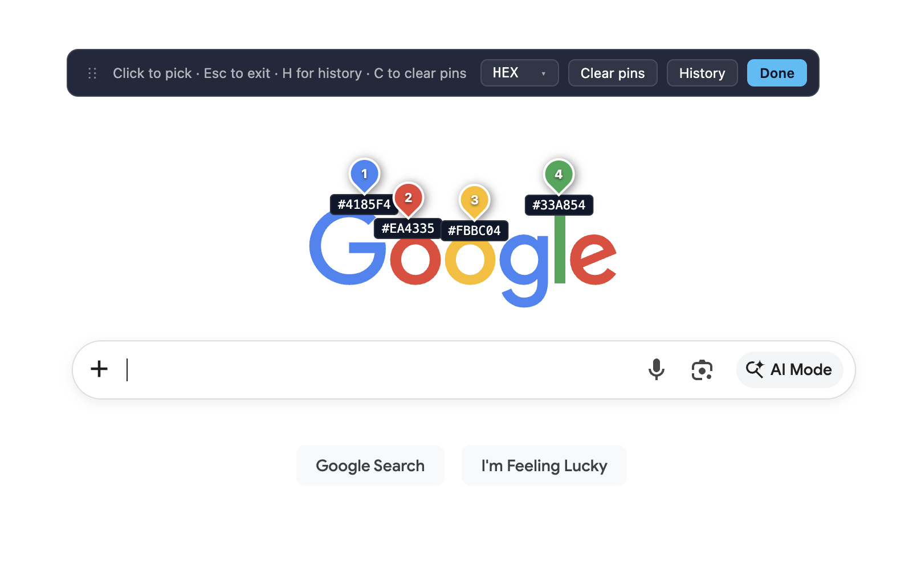
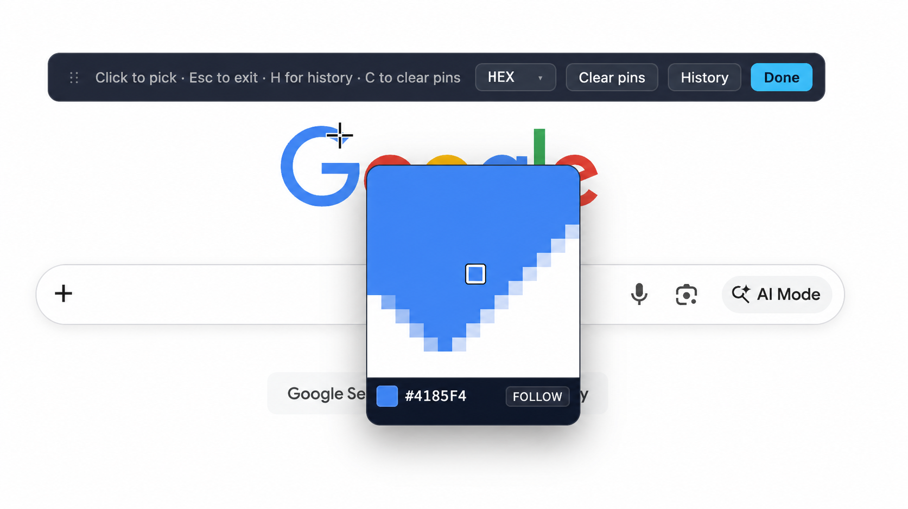
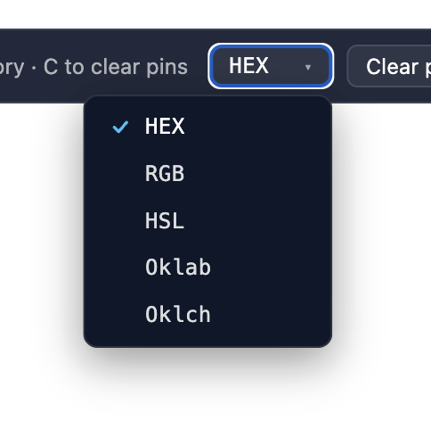
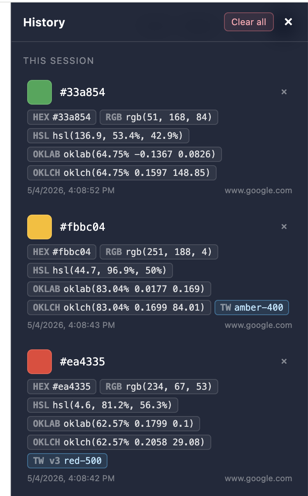

<div align="center">
  
  <h1>Basic Color Picker</h1>
  <p><strong>Drop pins on any web page. Copy modern color formats.</strong></p>
  <p>
    Chrome MV3 extension · HEX · RGB · HSL · Oklab · Oklch · Tailwind v3 + v4
  </p>
</div>

---

A no-frills color picker that does one thing well: click a toolbar icon, drop as many pins as you want on the current page, and read every pick back in every format you'd actually paste into CSS.

<p align="center">
  
</p>

## Why another color picker

Native `EyeDropper` closes after one pick. Most extensions show colors one-at-a-time in a popup. This one:

- **Multi-point in a single session** — drop as many pins as you want, see them all simultaneously.
- **Modern color spaces** — Oklab and Oklch alongside the classics, computed via the CSS Color 4 transform.
- **Tailwind detection** — exact-palette match against both v3 and v4 (including the new mauve/olive/mist/taupe families). When the picked element has `bg-orange-500`, that utility surfaces directly.
- **Persistent history** — every pick saved with source URL and time. Search and copy any earlier pick.
- **Movable overlay** — drag the magnifier or the toolbar out of the way when they cover what you're sampling.
- **Stays local** — no network calls, no analytics, no telemetry. History lives in `chrome.storage.local`.

## Install

### From source (until the Web Store listing goes live)

```sh
git clone https://github.com/IsItGreg/basic-color-picker
cd basic-color-picker
npm install
npm run build
```

Then in Chrome:

1. Visit `chrome://extensions`.
2. Toggle **Developer mode** (top right).
3. **Load unpacked** → select the `dist/` folder produced above.
4. Pin the extension from the puzzle-piece menu.

Reload after every `npm run build` from the same `chrome://extensions` page (the refresh icon on the extension's card).

### Web Store

_Pending review — listing copy and assets are checked in under [`docs/listing.md`](docs/listing.md)._

## Using

<table>
<tr>
<td width="50%">

</td>
<td width="50%">

</td>
</tr>
</table>

| Action | Effect |
| --- | --- |
| Click the toolbar icon | Toggle pick mode |
| Click on the page | Drop a numbered pin, save the color to history |
| Hover | Magnifier shows the pixel under the cursor with its HEX |
| Drag the toolbar grip (`⋮⋮` or help text) | Move the toolbar |
| Drag the magnifier info bar | Pin the magnifier; cursor still drives its preview |
| `FOLLOW` / `PINNED` button on magnifier | Toggle follow vs pinned |
| `H` | Toggle the history panel |
| `C` | Clear the current session's pins |
| `Esc` / Done button | Exit pick mode (history is preserved) |
| Click a swatch / format pill | Copy that format to the clipboard |
| Format dropdown | Change the primary format shown |
| **Clear all** in history | Two-step: click once to arm, again within 3 s to wipe |

### History panel

<p align="center">
  
</p>

Every pick keeps its full breakdown — HEX, RGB, HSL, Oklab, Oklch, plus any matching Tailwind class tagged with the version it came from (`TW v3 red-500`, `TW amber-400` when both v3 and v4 match identically, etc.). History is persisted across sessions in `chrome.storage.local` and capped at 500 entries.

## Permissions

| Permission | Why |
| --- | --- |
| `activeTab` | Read pixels from the currently-focused tab when you click the toolbar icon. |
| `scripting` | Inject the picker overlay on demand. No auto-injection on every page. |
| `storage` | Persist your color history in `chrome.storage.local` — local only. |
| `notifications` | Single notification when the picker can't run (e.g. on `chrome://` pages). |

The extension does **not** request `<all_urls>` host access and does **not** declare any `content_scripts`. It runs only on the active tab, only when you click its icon. See the [privacy policy](https://gsme.dev/basic-color-picker/privacy) for the full data story.

## Building / development

```sh
npm install
npm run dev        # vite dev server (background hot-reload)
npm run build      # produce dist/ — manifest, service worker, icons, overlay.js
npm run typecheck  # tsc --noEmit
npm run package    # build, then zip dist/ into basic-color-picker.zip (no source maps)
```

The build is two-stage:

1. **Default vite** — manifest, service worker, icons.
2. **`vite.config.overlay.ts`** — bundles `src/content/overlay.ts` as a single self-contained IIFE at `dist/overlay.js`. The background service worker injects this file via `chrome.scripting.executeScript` on icon click, so it must run as a classic script with no surviving `import` statements.

## Layout

```
src/
├── background.ts          Service worker — action click handler, captureVisibleTab proxy, history append
├── content/
│   ├── overlay.ts         Magnifier, pins, history panel, drag handles
│   ├── overlay.css        Shadow-DOM-scoped styles
│   ├── tailwind-map.ts    Default Tailwind v3 palette (hex)
│   └── tailwind-v4-map.ts Default Tailwind v4 palette (OKLCH source-of-truth)
├── lib/
│   ├── color.ts           sRGB ↔ HEX/RGB/HSL/Oklab/Oklch (CSS Color 4 transforms)
│   ├── tailwind-match.ts  Nearest palette lookup across v3+v4 with version tagging
│   ├── element-classes.ts Tailwind utilities surfaced from the picked element
│   └── storage.ts         chrome.storage.local wrappers + legacy-shape coercion
└── icons/
    ├── source.svg         Master icon (1024 viewBox)
    └── icon-{16,32,48,128}.png  Rendered + downscaled

docs/
├── privacy.md / privacy.html   Privacy policy (hostable via GitHub Pages)
├── listing.md                  Web Store listing copy reference
├── promo-440x280.png           Web Store small promo tile
└── screenshots/                In-action screenshots (used in this README)

scripts/
├── gen-icons.mjs           Original procedural icon renderer (superseded by source.svg)
└── verify-v4-hex.mjs       Sanity check: derived v4 hex matches Tailwind's published values
```

## Limitations

- Restricted pages (`chrome://`, web store, `file://`) are skipped with a notification — Chrome doesn't allow extensions to inject there.
- Page scroll is locked while the picker is open; scroll to the area you want to sample, then click the icon.
- Cross-origin iframes are captured correctly for pixel sampling, but element-based Tailwind detection can't see inside them.
- Tailwind detection covers the default v3 + v4 palettes; custom theme configs aren't read.

## License

MIT
